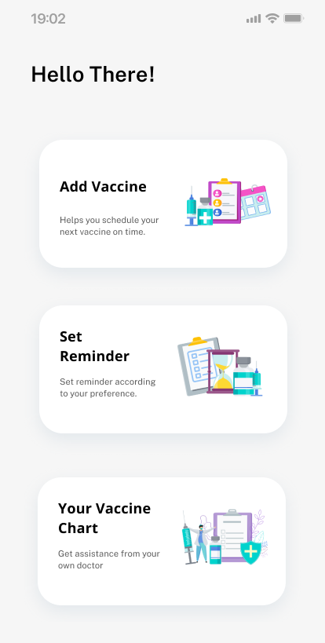
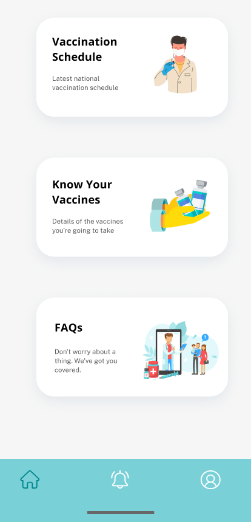
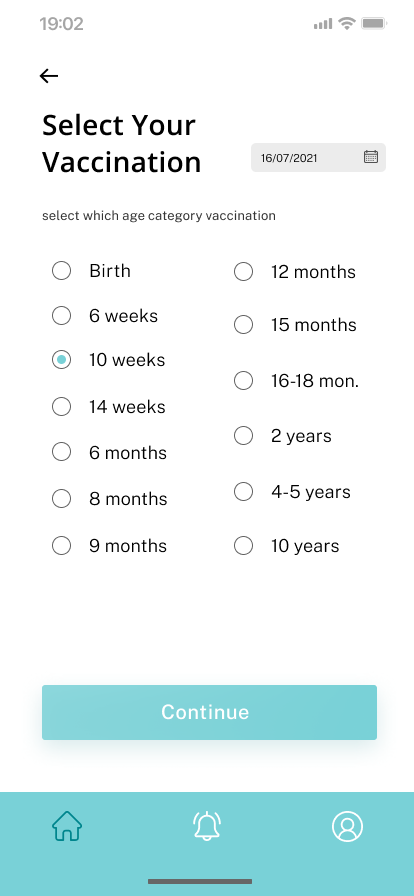
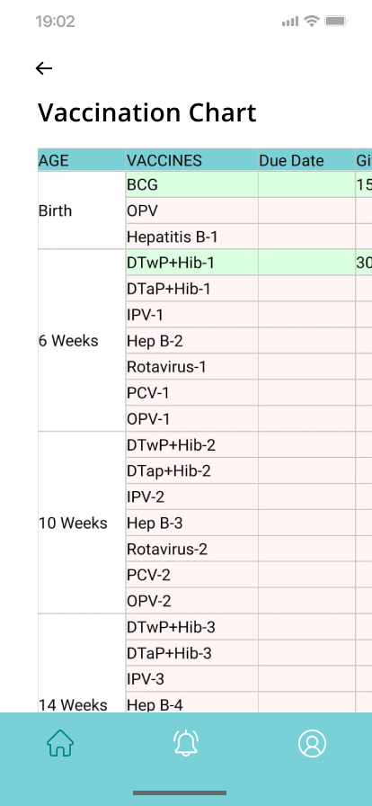
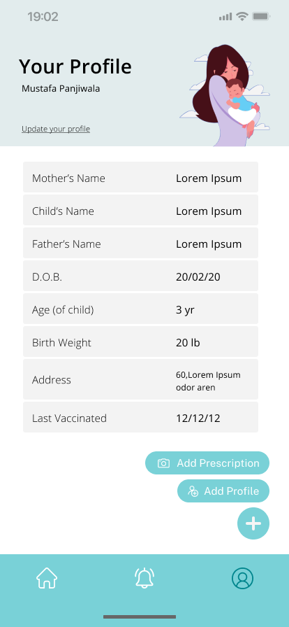

# VacSeen App

VacSeen is a mobile application that helps parents keep track of their child's vaccination records, set reminders for upcoming vaccines, and stay informed about the latest vaccination schedules. With VacSeen, you can easily create and edit your child's vaccination chart, generate a PDF version of the chart, and share it with your doctor.

Built on React Native(Frontend) and Firebase(for Backend).

## Features
-Create and maintain a digital vaccination chart for your child
-Edit and update the vaccination chart as needed
-Generate a PDF version of the vaccination chart for easy sharing and printing
-Set reminders for upcoming vaccines to ensure timely administration
-Access the latest vaccination schedules recommended by health authorities
-Get information about the latest vaccines available for children

## Key Features at a Glance

Check out these screenshots to see how VacSeen simplifies vaccination tracking and management for parents.

  

## Authors

- [@sachinmotwani02](https://github.com/sachinmotwani02)
- [@mustafapanjiwala](https://github.com/mustafapanjiwala)
- [@Dev967](https://github.com/Dev967)

